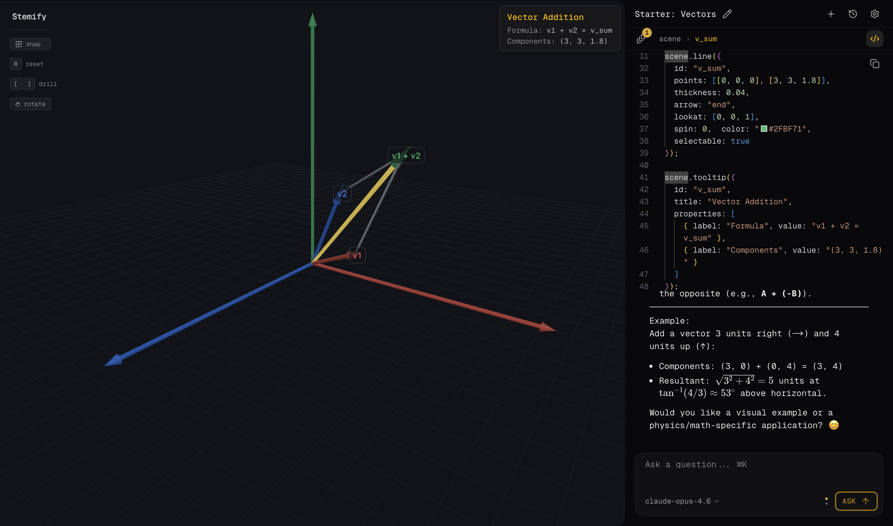

# Stemify

Stemify - learn (or teach) STEM visually with interactive scenes and AI. Generate scenes to explore subjects, concepts and problems. Edit objects, experiment, and ask anything you want. Bring your [OpenRouter](https://openrouter.ai) API key.

[Download for macOS / Windows](https://github.com/igoakulov/stemify/releases)

## Features

- **Two Chat Modes**:
  - **BUILD** - Create or update your 3D scene with natural language
  - **ASK** - Get explanations, walkthroughs, and insights (general or scene-specific)
- **Full control, simple code**: Edit the scene or individual shapes yourself, directly in code (friendly library of shapes, autocomplete and automatic versioning)
- **Rotate Or Fly**: Choose to rotate camera around center of the scene or freely fly all around (speed, reset)
- **Convenience**: Hotkeys for everything, recent scenes, autocomplete and build-in documentation, self-troubleshooting
- **Local-First**: Runs and stores data (only) on your device
- **Full History**: All settings, sscenes, versions, conversations, backup
- **Assistant Customization**: Choose ANY model (some are free), customize instructions and preferences in all system prompts

## Data Storage

All data is stored locally on your device. No data is sent to any server except OpenRouter for AI requests.

### Desktop App

Data is stored in the system application support folder:

| Platform | Location |
|----------|----------|
| **macOS** | `~/Library/Application Support/stemify/` |
| **Windows** | `%APPDATA%/stemify/` |
| **Linux** | `~/.config/stemify/` |

This includes your API key, scenes and versions, conversations, and settings.

## Tech Stack

- **Framework**: Next.js 16 (App Router) + React 19 + TypeScript 5
- **3D Rendering**: Three.js with React Three Fiber
- **Styling**: Tailwind CSS v4 + shadcn/ui for general, assistant-ui for chat
- **AI Integration**: OpenRouter
- **State Management**: Zustand for local state, assistant-ui for chat

## Feedback

Questions? Suggestions? [Start a discussion](https://github.com/igoakulov/stemify/discussions/1) or reach out on X:[@igoakulov](https://x.com/igoakulov).

## License

MIT
